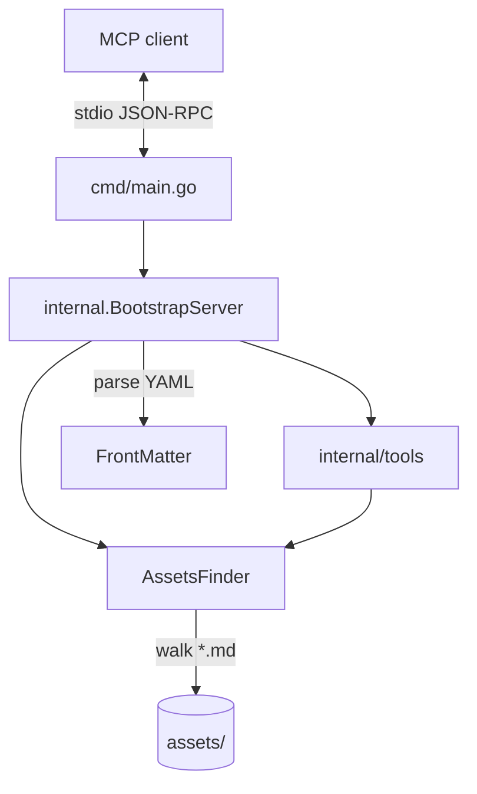

# Architecture — mcp

| Component | Path | Role |
|-----------|------|------|
| Entrypoint | `cmd/main.go` | Logger, asset root, stdio server |
| Bootstrap | `internal/server.go` | Register resources and tools |
| Assets | `internal/utils/assets.go` | Walk and read `assets/` or `MCP_ASSET_ROOT` |
| Models | `internal/models/` | YAML frontmatter |
| Tools | `internal/tools/` | discover/search standards and workflows |
| Payload | `assets/` | Markdown registered as resources |

Resource reads return the full file, including frontmatter. New documents do not need Go changes. The server reads `assets/` once at startup.
